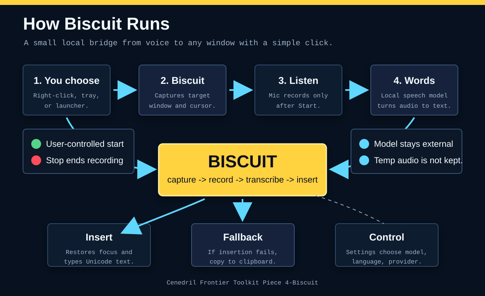

# Biscuit

Biscuit is a Windows-first dictation overlay. Right-click anywhere, choose the small `biscuit` action, speak, stop recording, and Biscuit inserts the transcribed text back into the clicked window.



For a simple trust-focused map of the moving parts, see [Biscuit Ontology](docs/biscuit-ontology.md).

The first build is intentionally lean:

- Python/Win32 source tool.
- Native Windows shell context-menu entries for files, folders, folder backgrounds, and drives.
- Tiny topmost right-click overlay for private app menus that Windows does not expose through shell registration.
- Tiny Biscuit tray/menu-bar icon for settings and cursor dictation, with a floating `biscuit` fallback button if tray support is missing.
- Public default speech model source with optional local model override.
- No model blobs copied into this repository.

## Run

```powershell
.\scripts\run_biscuit.ps1
```

## Launchers

Double-click or run the launcher for the current desktop:

- Windows: `Biscuit-Windows.cmd`
- Linux: `biscuit-linux.sh`
- macOS: `Biscuit-macOS.command`

On Windows, the launcher starts Biscuit with `pythonw.exe` when available, so no command window stays open. Biscuit should only be visible through the tray icon, the settings panel, and the dictation overlays.

There is also a movable Windows shortcut in the project folder:

```text
Run Biscuit.lnk
```

It points back to `Biscuit-Windows.cmd` and uses `assets\Biscuit.ico`, so you can drag or copy it to the Desktop and keep the Biscuit icon.

Linux and macOS users may need to mark the launcher executable after checkout:

```bash
chmod +x biscuit-linux.sh Biscuit-macOS.command
```

## Install-Style Setup

On Windows, double-click:

```text
Install-Biscuit-Windows.cmd
```

That wrapper runs the installer, registers Biscuit in context menus, adds a Startup shortcut, and launches Biscuit immediately. Use the script directly when you want the no-launch test path:

```powershell
.\scripts\install_windows.ps1 -NoLaunch
```

```bash
./scripts/install_linux.sh
./scripts/install_macos.sh
```

The installers install Python dependencies and prefetch the default speech model from:

```text
Systran/faster-whisper-tiny.en
https://huggingface.co/Systran/faster-whisper-tiny.en
```

Windows creates Start Menu and Startup shortcuts, launches Biscuit, and registers a `Biscuit` command in Explorer-style context menus for files, folders, folder backgrounds, and drives. Linux creates a `biscuit.desktop` application entry. macOS creates `~/Applications/Biscuit.app`. At runtime Biscuit tries to show a tiny blue-black/yellow Biscuit icon in the system tray or menu bar; if tray support is not available, it shows the small themed floating Biscuit button.

When Biscuit is already running, the Windows context-menu command signals that running app instead of starting a cold process. Biscuit also warms the selected speech model in the background after startup so normal use avoids the slowest first-load path.

Biscuit keeps a compact readiness view for the core path: invocation, microphone backend, selected model/provider, and captured target. The readiness view is intentionally small and appears as operational status rather than a dashboard.

The settings panel has:

- Model
- Language
- Provider
- Find Model
- Start Biscuit
- Quit Biscuit
- Save

`Find Model` searches common local cache locations for supported speech model files. The default config uses the hosted faster-whisper model above, so a new checkout can run without any private paths. Use Browse only when you want to point Biscuit at your own local model file.

For GGUF/GGML models, set Provider to a GGUF-capable runner such as `whisper-cli.exe` when it is available on the machine. Leave Provider as `auto` for the hosted faster-whisper source, Python-backed local model directories, or model names.

To prefetch the default hosted model manually:

```powershell
$env:PYTHONPATH = "src"
python -m pip install -r requirements.txt
python scripts\prefetch_model.py
```

## Package

```powershell
.\scripts\package_biscuit.ps1
```

The package script uses PyInstaller when available and writes output to `dist\Biscuit`. Large model files and recordings are ignored by git.

## Notes

Windows apps own their private context menus. Biscuit registers native shell menu entries where Windows allows it, and uses a topmost overlay action at the cursor for private app menus so the workflow stays universal: right-click, click Biscuit, speak, insert.

When direct insertion is blocked or the target is gone, Biscuit copies the finished text to the clipboard and reports that fallback in the recording status.
